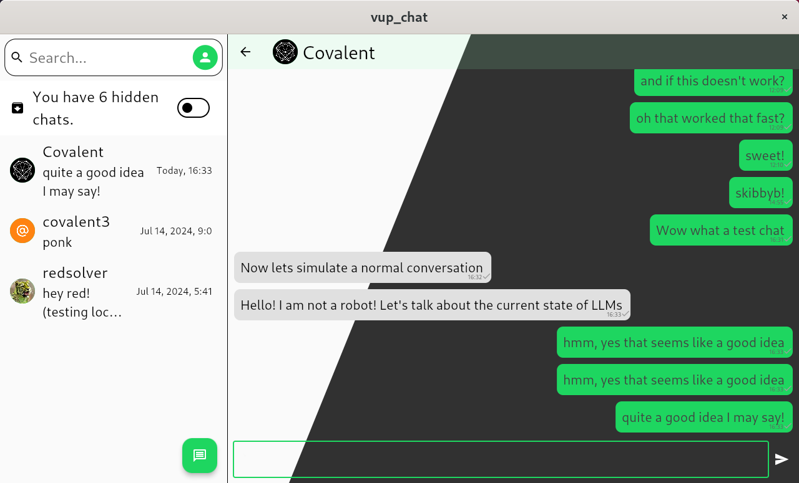

# Vup Chat

A cross-platform, ATProto & S5 powered chat client.



### What

Vup Chat is a messaging client build on top of the [AT Protocol](https://atproto.com/). It both provides dedicated messaging clients for cross-platform usage. By utilizing the S5 network, it allows users to have more advanced features like E2EE and media embeds (coming soon).

### Usage

> ⚠️ This app is still in rapid development, so things are likely to change and break. All messages are currently backed up to ATProto. Once E2EE is implemented, the DB will become stable and breaking changes will not be pushed on minor (x.X.x) versions.

| Supported Platforms |     |
| ------------------- | --- |
| Android             | ✓   |
| iOS                 | 🗙   |
| Macos               | 🗙   |
| Linux               | ✓   |
| Windows             | 🗙   |
| Web                 | ✓   |

>

Download the binary for your platform on the [releases](https://github.com/vup-app/vup-chat/releases) page.

Development site is available [here](https://vup-chat.jptr.tech). Alternatively you can build the app yourself for any supported platform.

```bash
# Prerec, install flutter (https://flutter.dev/)
git clone https://github.com/vup-app/vup-chat.git
cd vup-chat
flutter pub get
flutter build exe --your-params
```

### TODO:

- [x] Basic bsky compatibility
- [x] Move backend to messaging service w/ local sqlite db
- [ ] E2EE messaging over S5 streams
- [ ] Other data over S5 network (images, videos, voice memos)
- [ ] Regular backups of sqlite DB to S5

### Acknowledgement

This work is supported by a [Sia Foundation](https://sia.tech/) grant
